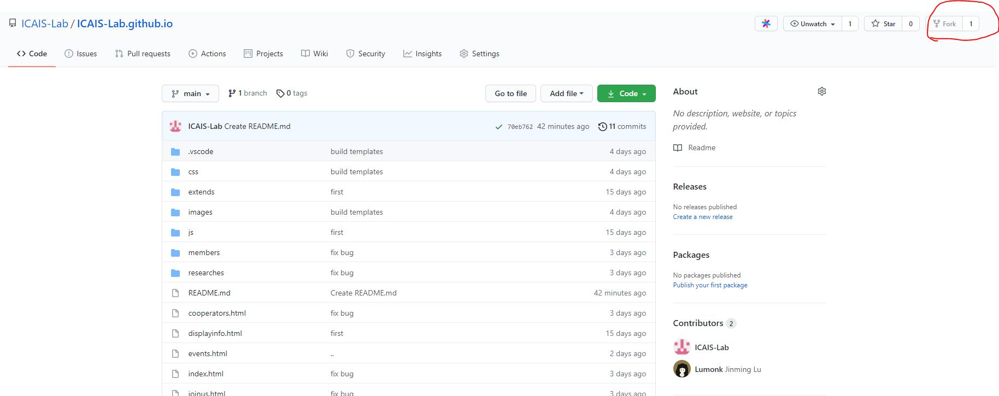

# ICAIS-Lab.github.io

## Github 仓库Pull Request 流程

1. Fork 原仓库地址到个人账户, 

      

2. Clone fork仓库到本地
   ```
   git clone https://github.com/xxxx/ICAIS-Lab.github.io
   ``` 
3. 在本地仓库中链接原仓库
    ```
    git remote add upstream https://github.com/ICAIS-Lab/ICAIS-Lab.github.io
    ```
4. 新建分支, 修改本地文件
   ```
   git checkout -b <branchName>
   git status
   git add .
   git commit -m '描述'
   git push origin <branchName>
   ```
5. create pull request